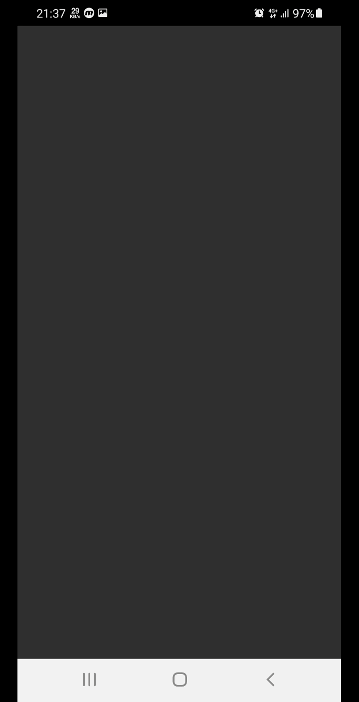
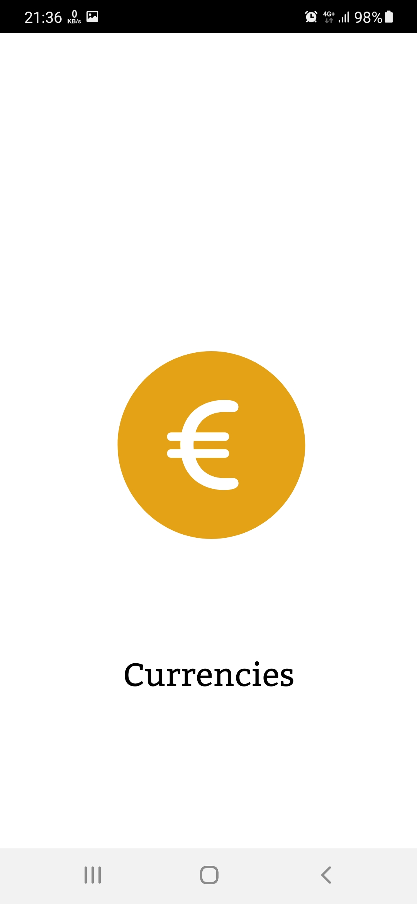
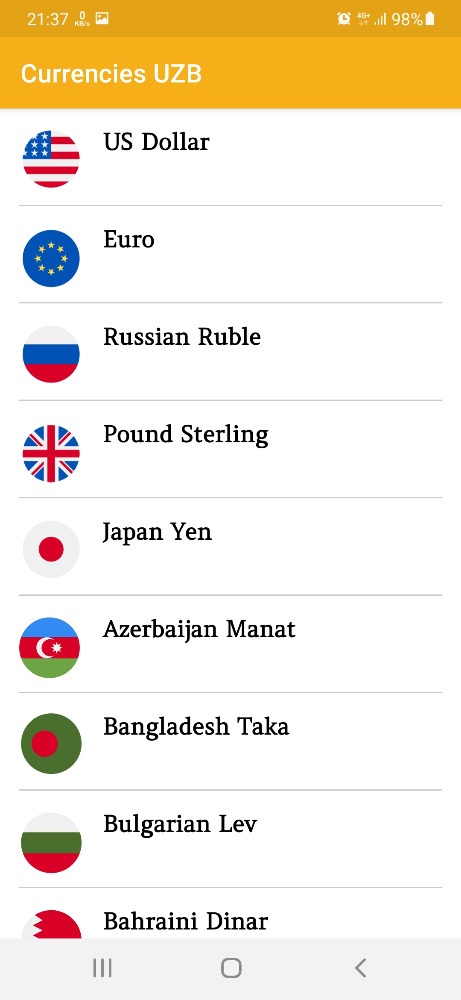
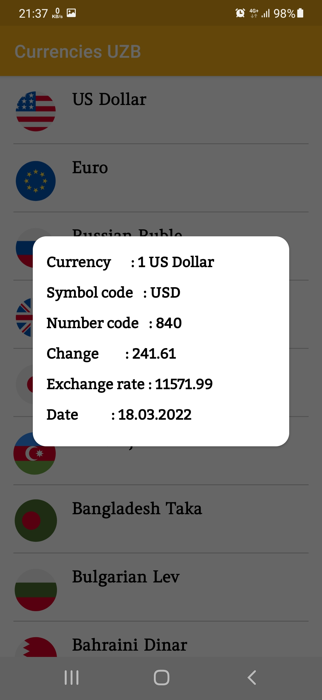

# Currencies UZB

<h4>You can find The Сentral Bank of the Republic of Uzbekistan fixed the following rates of the foreign currencies every day by the application.<h4>

  
  
 
  

<h3>I made icons for this app.<h3>

  
  
Resources:
 
<a href = "https://lottiefiles.com/23102-currencies-use-any-background">LottieFiles</a>

<a href = "https://www.figma.com/file/ZNCE5t78CytN8lT9Ybbsm0/Untitled?node-id=0%3A1">Figma</a>

